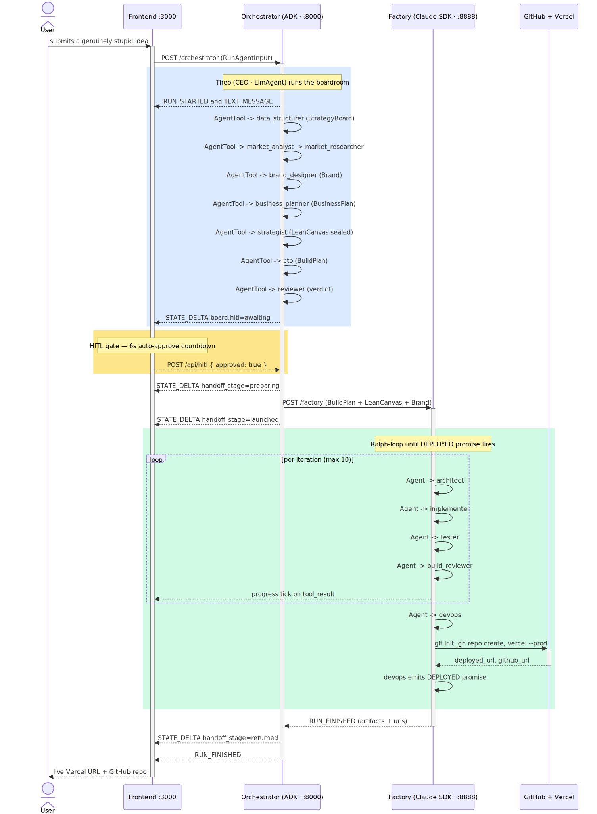

# Startup in a Box — Architecture

> The deep version of the README. Read this if you're going to **teach** this system, not just run it.

**Tagline:** Two agent frameworks, one typed handoff, zero glue code. A dumb idea comes in, a deployed Next.js app comes out.

---

## 1. What this system actually is

Three independent services, unified by a single protocol:

| Module | Port | Runtime | Framework | Role |
|--------|------|---------|-----------|------|
| **Orchestrator** | `:8000` | Python 3.11 · FastAPI | **Google ADK** + `ag-ui-adk` | Plans. "The Boardroom." |
| **Factory** | `:8888` | Python 3.11 · FastAPI | **Claude Agent SDK** + vendored plugins | Builds. "The Factory." |
| **Frontend** | `:3000` | Node 20 · Next.js 16 | React 19 · PixiJS 8 · CopilotKit | Shows it. "The Stage." |

Both backends speak [**AG-UI Protocol**](https://github.com/ag-ui-protocol/ag-ui) over SSE. The frontend has exactly one event reducer — it doesn't know or care which backend sent the packet. That's the whole punchline of the protocol layer.



---

## 2. Why two frameworks? (The pedagogical point)

This is the core argument of the talk. If you remember nothing else, remember this:

> **Google ADK is good at *planning*. Claude Agent SDK is good at *building*.**
> Use them where they shine. Stop trying to make one do both.



### ADK shines for planning because

- **Typed artifacts as first-class citizens.** `output_schema=LeanCanvas` on an `LlmAgent` binds its output to a Pydantic model. The framework enforces the schema; you don't hand-roll JSON parsing prayer circles.
- **Provider-flexible reasoning.** Gemini first, LiteLLM for everyone else. Swap models per-agent (Flash-Lite for cheap specialists, Pro for the CTO) in `settings.py`.
- **The AgentTool delegator pattern.** A parent `LlmAgent` can call child agents *as tools* and keep control. Returns stay in the parent's conversation. This is the cleanest "boss + specialists" topology in any framework.
- **`session.state` + `output_key`.** Each specialist writes its typed output to shared state, and `ag-ui-adk` auto-emits a `STATE_DELTA` for every write. That's why the boardroom UI updates in real time without the agent code knowing anything about SSE.

### Claude Agent SDK shines for building because

- **Real filesystem and shell, not emulated.** `Read`, `Write`, `Edit`, `Glob`, `Grep`, `Bash` are the built-ins. No MCP ceremony.
- **The Claude Code system prompt is available as a preset.** `system_prompt={"type": "preset", "preset": "claude_code", "append": ...}` gives you Anthropic's entire tool-use tutorial for free, then layers your rules on top.
- **Subagents via `AgentDefinition`.** Each subagent is scoped to a tool subset and has its own prompt. The supervisor picks which one to hand a step to via the `Agent` tool.
- **Plugins are real.** Drop a plugin folder at `vendor/<name>/`, register it in `ClaudeAgentOptions.plugins`, and you get `/slash-commands`, hooks, and agent overrides inside the session.
- **Hooks are Python callbacks with enforced semantics.** A `PreToolUse` hook returning `{"permissionDecision": "deny"}` *actually blocks* the tool call. The agent sees the reason and adapts on the next turn.
- **Session isolation.** `setting_sources=[]` makes the run not inherit your dev machine's Claude Code config. No plugin cross-contamination. Critical for reproducibility.

### The handoff is a POST

Nothing fancy. The CEO's terminal action is calling the `start_factory` FunctionTool, which POSTs a validated Pydantic `BuildPlan` + `LeanCanvas` + `Brand` to `http://localhost:8888/factory`. The factory streams SSE back. `httpx.AsyncClient.stream` consumes it. `RUN_FINISHED` triggers Beat 3. Done.

---

## 3. The Boardroom (Orchestrator · ADK)

### Cast of characters



| Role | Agent | Output artifact |
|------|-------|-----------------|
| 👔 CEO | `ceo` (coordinator) | — (drives the room) |
| 📋 Data Structurer | `data_structurer` | `StrategyBoard` |
| 🔍 Market Analyst | `market_analyst` + `market_researcher` (child) | `MarketAnalysis` |
| 🎨 Juno · Brand Designer | `brand_designer` | `Brand` |
| 📈 Business Planner | `business_planner` | `BusinessPlan` |
| ✒️ Yara · Strategist | `strategist` | `LeanCanvas` (sealed 9 blocks) |
| 🛠 Sam · CTO | `cto` | `BuildPlan` |
| 🧐 Reviewer | `reviewer` | `PlanReview` verdict |

Each has a distinct voice in its `instruction=` block, because it turns out agents that have a character are easier to debug — the UI speech bubbles tell you who misbehaved.

### The market-analyst split

Gemini refuses `output_schema` on any agent that also uses a built-in tool like `google_search`. We can't have the same agent both *search the web* and *return a typed JSON artifact*. The fix is the same AgentTool pattern the CEO uses, one level deeper:

- **`market_researcher`** — `LlmAgent` with `google_search` attached. No `output_schema`. Returns prose findings + URL citations.
- **`market_analyst`** — `LlmAgent` that calls `market_researcher` as its only tool, then emits structured `MarketAnalysis` JSON. Shape is enforced *either* by OpenRouter's `response_format={"type": "json_schema", ...}` (when routed through LiteLLM) *or* by a prompt pin + the downstream Pydantic validator (when routed native-Gemini, which can't carry a response schema alongside function tools).

SRP in two lines: *parent structures, child researches.* Same split trick works for any future "tool-using artifact emitter" role.

### The AgentTool delegator pattern



```python
ceo = LlmAgent(
    name="ceo",
    model=settings.ceo_model,
    instruction=_CEO_INSTRUCTION,
    tools=[
        AgentTool(agent=build_data_structurer(...)),
        AgentTool(agent=build_market_analyst(...)),
        AgentTool(agent=build_brand_designer(...)),
        AgentTool(agent=build_business_planner(...)),
        AgentTool(agent=build_strategist(...)),
        AgentTool(agent=build_cto(...)),
        AgentTool(agent=build_reviewer(...)),
        send_back_tool,
        start_factory_tool,
    ],
)
```

**Why AgentTool and not `sub_agents=[...]` + `transfer_to_agent`?** Because a child agent with `output_schema=` set **cannot transfer control back** — `output_schema` disables tool-calling and transfers on that agent. With `AgentTool`, the child runs, returns JSON, control returns to the parent. The CEO stays in the driver's seat every turn.

### `output_key` → STATE_DELTA magic

Each specialist sets `output_key="<artifact>"` on its `LlmAgent`. ADK writes the reply to `session.state[<artifact>]`. `ag-ui-adk` forwards that write as an AG-UI `STATE_DELTA` event. The frontend's `useAgUiEvents` reducer merges it into the shared state tree. The boardroom UI re-renders. No code in between.

### Two CEO reliability fixes

Inside `build_ceo_agent`:

1. **`function_calling_config.mode = ANY`** — forces Gemini to emit a tool call every turn. Without it, Flash sometimes drops a trailing `function_call` past ~8K context and the boardroom stalls.
2. **`HttpRetryOptions(attempts=4, http_status_codes=[503, 429])`** — exponential backoff on the google-genai client. Live demos are not the time to eat a single 503.

### The Lean Canvas funnel



The four upstream specialists (structurer, analyst, brand, planner) all write to `session.state`. **Yara the Strategist** reads all four and seals a 9-block Lean Canvas. **Sam the CTO** reads the canvas — and **only** the canvas — to emit the BuildPlan. This gives us one sealed source of truth for downstream decisions.

The canvas travels with the BuildPlan through the handoff, and the factory's Claude prompt quotes it verbatim as ground truth:

> *If the canvas and the build plan disagree, the canvas wins.*

---

## 4. The Factory (Claude Agent SDK)

### The supervisor loop



The factory's `client.query(...)` sends the full BuildPlan as a user prompt. The supervisor (top-level Claude session) delegates each step to the appropriate subagent via the `Agent` tool. Claude reads the workspace and git state before acting, so it picks up where the previous step left off. The run succeeds when the `devops` subagent prints a live Vercel URL after `vercel --prod`.

### Subagents

```python
SUBAGENTS: dict[str, AgentDefinition] = {
    "architect":      AgentDefinition(tools=["Read","Write","Glob","Grep"], prompt=...),
    "implementer":    AgentDefinition(tools=["Read","Write","Edit","Glob","Grep","Bash"], prompt=...),
    "tester":         AgentDefinition(tools=["Read","Grep","Glob","Bash"], prompt=...),
    "devops":         AgentDefinition(tools=["Read","Write","Edit","Bash"], prompt=...),
    "build_reviewer": AgentDefinition(tools=["Read","Grep","Glob"], prompt=...),
}
```

The supervisor delegates every step via the `Agent` tool. Subagents never call each other directly — they all report back to the supervisor, which picks the next one. This is the factory's equivalent of the ADK delegator pattern, just expressed in a different shape.

### Skills = dual-path contracts

Three skills under `factory/skills/` get symlinked into each workspace's `.claude/skills/` at session start. Each enforces the same contract:

> **Zero env vars → convincing mock. Set the right env var → real provider. No code change.**

| Skill | Mock default | Real provider trigger |
|-------|--------------|------------------------|
| `stripe-checkout` | Mock checkout page | `STRIPE_SECRET_KEY` |
| `vercel-neon` | In-memory store in `lib/db.ts` | `DATABASE_URL` (auto-injected by the Vercel Neon integration) |
| `external-apis` | Hand-written canned responses | `AI_GATEWAY_API_KEY`, `OPENAI_API_KEY`, `RESEND_API_KEY`, ... |

The generated `.env.example` is the upgrade manual — every optional env var goes there with a URL to where you can get the key.

### Quality hooks

| Hook | Event | Effect |
|------|-------|--------|
| `pre_bash_guard` | `PreToolUse` (Bash) | Denies destructive commands (`rm -rf /`, `git push --force`, `git reset --hard`, `--no-verify`, `sudo`, fork bombs). Returns `permissionDecision: "deny"` with a reason. |
| `rtk_rewrite` | `PreToolUse` (Bash) | If `rtk` is on PATH, returns `updatedInput` with the compressed equivalent (`git status` → `rtk git status`). No-op otherwise. |
| `post_write_lint` | `PostToolUse` (Write/Edit) | Scans new TS/JS for `console.log`, bare `any`, unjustified `@ts-ignore`, `debugger`, empty files. Pushes findings via `additionalContext` so the next turn fixes them. |

All three are plain Python callbacks registered on `ClaudeAgentOptions.hooks`.

### Vendored plugins

`factory/vendor/`:

- **`caveman/`** — `SessionStart` + `UserPromptSubmit` hooks that enable ~75% token compression for the whole factory run.

Registered in `runner.py` as:

```python
vendored_plugins = [
    {"type": "local", "path": str(caveman_path)},
]
```

Missing vendors log a warning and skip, so the run degrades gracefully instead of hard-failing.

### Session isolation

Two options matter:

- **`setting_sources=[]`** — the run does not inherit the dev machine's user/project Claude Code settings. Without this, your globally-installed `vercel@claude-plugins-official` plugin would leak into the session.
- **`cwd=workspace/<thread_id>`** — each run gets its own directory under `factory/workspace/`. The `.claude/` subdirectory is created fresh per run.

### Error handling

The SDK call is wrapped in a typed `try/except` tree, not a catch-all:

```python
except CLINotFoundError:      # CLI not on PATH
except CLIConnectionError:    # lost connection
except ProcessError:          # CLI exited non-zero (auth, billing)
except CLIJSONDecodeError:    # malformed JSON from CLI
except ClaudeSDKError:        # future SDK-specific
except asyncio.CancelledError: # client disconnected
```

Each branch emits a specific `RUN_ERROR` with a message the UI displays verbatim. `_detect_cli_failure()` classifies zero-message runs ("Credit balance too low", "Invalid API key", rate-limit hits) from captured stderr.

---

## 5. The Stage (Frontend · Next.js 16)

### Routing

- `/` — single-page app (`ClientApp.tsx`) that renders both screens via tabs (`ScreenTabs.tsx`).
- `/api/copilotkit/[...path]` — SSE proxy from the browser to `:8000/orchestrator`.
- `/api/ag-ui-log` — POST endpoint for client-side AG-UI event logging (used by agent-flow visualization).

### Component tree

```
<ClientApp>
  <HudShell>
    <AppHeader>
      <AppStatusCluster>   (cost chip, latency, connection)
    </AppHeader>
    <ScreenTabs>
      <BoardroomScreen>    PixiJS stage + LeanCanvasManuscript
      <FactoryScreen>      mounts embedded agent-flow component + Run panel
    </ScreenTabs>
    <IdeaLauncher>         prompt bar
    <ApprovalCard />       renders on HITL TOOL_CALL
    <UnicornTransition />  celebration at RUN_FINISHED
  </HudShell>
</ClientApp>
```

### AG-UI event flow



A single `useAgUiEvents` reducer consumes events from both backends. The shared state tree holds:

- `active_agent` — who's speaking right now
- `lean_canvas`, `business_plan`, `build_plan`, `brand`, `strategy_board`, `market_analysis`, `plan_review`
- `handoff_stage` — `"idle" | "preparing" | "launched" | "returned" | "failed"`
- `progress` — `{steps_completed, steps_total}`
- `total_cost_usd`, `usage`, `num_turns`, `duration_ms` (from factory `ResultMessage`)
- `deployed_url`, `github_url`

Each PixiJS scene reads from this state and animates accordingly. No polling, no WebSockets of our own, no Redis.

### The handoff cinematic



**Beat 1 — Send** (driven by `handoff_stage: "preparing"` → `"launched"`):
- Boardroom desaturates, Theo walks to the pneumatic tube, scroll sprite appears.
- 1.5s deliberate pacing before the factory POST completes — lets the audience register what's happening before the factory screen lights up.

**Beat 2 — Receive** (driven by factory `RUN_STARTED`):
- Factory was rendered dark on load; now powers on in a 4-step cascade.
- Agent-flow node graph starts drawing subagent invocations as they fire.

**Beat 3 — Return** (driven by `handoff_stage: "returned"`):
- SHIPPED scroll returns, boardroom re-saturates, `UnicornTransition` confetti.
- Lean canvas flips to SHIPPED overlay. Deploy artifact shows live URL + repo URL.

---

## 6. Where things run



### Make targets

| Target | What |
|--------|------|
| `make install` | `uv sync` both Python services, `npm install` frontend |
| `make dev` | All three services with `--reload`, local/default models |
| `make demo` | Same but forces Gemini 3.1 Pro + Claude Sonnet 4.5 |
| `make dev-auto IDEA="..."` | Boots dev stack AND auto-submits the idea via `scripts/dev-auto.py` |
| `make kill-ports` | Kills leftover processes on 3000/8000/8888 |
| `make test` | All three test suites |
| `make adk-web` | Launches ADK's own dev UI on its agents (useful for raw event inspection) |

### Model knobs

Per-agent model overrides in `orchestrator/.env`. Defaults route through OpenRouter (LiteLLM), but any model name is accepted — `_model.build_model` picks the transport from the prefix:

| Var | Default | Used by |
|-----|---------|---------|
| `ORCHESTRATOR_MODEL` | `openrouter/google/gemini-2.5-flash` | fallback for specialists |
| `CEO_MODEL`          | `openrouter/google/gemini-2.5-flash` | Theo |
| `CTO_MODEL`          | `openrouter/google/gemini-2.5-pro`   | Sam (Pro recommended for sharper BuildPlans) |
| `GOOGLE_API_KEY`     | —                                    | native google-genai transport |
| `OPENROUTER_API_KEY` | —                                    | OpenRouter transport (exported to LiteLLM at boot) |

To switch an individual agent back to native Gemini, set e.g. `CEO_MODEL=gemini-3.1-pro-preview`. No code change, no restart of the other agents' routing.

Factory: `FACTORY_MODEL` picks the top-level **runner** model (default `anthropic/claude-opus-4.7`). Subagents pin their own tier in `factory/src/factory/subagents.py` — `architect=opus`, `implementer` and `build_reviewer=sonnet`, `tester` and `devops=haiku` — so ITPM pressure is split across all three Anthropic rate-limit buckets and each tier's workload matches its strength (plan-smart, execute-cheap).

### Ports / endpoints / protocols

| Service | Port | Endpoint | Protocol |
|---------|------|----------|----------|
| Orchestrator | `8000` | `POST /orchestrator` | AG-UI over SSE |
| Orchestrator | `8000` | `GET /health?deep=true` | JSON |
| Factory | `8888` | `POST /factory` | AG-UI over SSE |
| Factory | `8888` | `GET /health?deep=true` | JSON |
| Frontend | `3000` | `/` | Next.js HTML |
| Frontend | `3000` | `/api/copilotkit/*` | SSE proxy → orchestrator |
| Frontend | `3000` | `/api/ag-ui-log` | JSON POST |
| Agent-flow (dev viz) | `3001` | `/` | WS / HTTP |
| LM Studio (dev) | `1234` | `/v1/*` | OpenAI-compatible |

---

## 7. End-to-end flow



1. **Ingest.** User submits an idea. Frontend POSTs to `/api/copilotkit/*`, which proxies to `:8000/orchestrator`.
2. **Boardroom.** CEO calls specialists as AgentTools. `market_analyst` internally calls `market_researcher` for citations, then seals its own `MarketAnalysis`. Each writes a typed artifact to `session.state` — every write becomes a `STATE_DELTA`. Yara seals the canvas. Sam drafts the BuildPlan. Reviewer approves (or `send_back_with_notes` → loop).
3. **HITL gate.** CEO calls `start_factory`. Orchestrator emits `STATE_DELTA { board.hitl: "awaiting" }` and *pauses* on a pending future keyed by `thread_id`. Frontend shows an approval modal with a 6s visible countdown (operator can cancel or reject). A POST to `/api/hitl` resolves the future.
4. **Handoff.** On approve: orchestrator emits `handoff_stage: "preparing"`, sleeps 1.5s for Beat 1, POSTs BuildPlan+LeanCanvas+Brand to `:8888/factory`, emits `handoff_stage: "launched"`.
5. **Factory.** The supervisor delegates each BuildPlan step to subagents in order. Skills guide mocked-first behavior. Hooks vet every Bash and flag lazy code. `ProgressTracker` ticks a step forward each time a subagent's `tool_result` comes back (so the visible progress bar tracks completion, not dispatch). Devops runs `git init` → `gh repo create` → `vercel --prod`.
6. **Finish.** Factory emits `RUN_FINISHED {artifacts, deployed_url, github_url}`. Orchestrator consumer unblocks, emits `{handoff_stage: "returned"}`, then its own `RUN_FINISHED`. Frontend plays Beat 3 + unicorn transition.

---

## 8. Known risks & operational notes

### The `ag-ui-claude-sdk` package

We don't use the community `ag-ui-claude-sdk` adapter — we hand-rolled the AG-UI encoder in `factory/src/factory/stream.py`. Two reasons:

1. The adapter expected strict Anthropic Messages API format, which complicates local-model setups (LM Studio, etc.).
2. Hand-rolling gives us full control over the `STATE_DELTA` shape, which is where the UI gets its Lean Canvas / progress / cost data.

The AG-UI protocol itself is standard; we encode it ourselves.

### CORS

Both FastAPI servers need CORS middleware allowing `http://localhost:3000`. Already wired in both `server.py` files. If you change the frontend port, update `cors_origins` in both `settings.py` files.

### Session cleanup between demo runs

Every run creates `factory/workspace/<thread_id>/`. Between demo runs you can either:

- pass a fresh `thread_id` in the next `RunAgentInput` (what the frontend does automatically), or
- nuke the workspace dir and start fresh: `rm -rf factory/workspace/*`

State does *not* leak between runs — each `thread_id` gets its own workspace + `.claude/` directory.

### Live demo tips

- Pre-warm both services with a `curl :8000/health?deep=true` and `:8888/health?deep=true` check — `deep=true` hits the LLM once, catches billing/auth issues before you're on stage.
- Use **`make demo`** on stage (Gemini Pro + Claude Sonnet). Local models are fine for iteration, not for an audience.
- Pick ideas you've pre-tested. The failure mode isn't "wrong output" — it's "model runs out of context" or "Vercel token expired at the worst possible moment." Test the full pipeline the morning of.

---

## 9. Further reading (repo-internal)

- [`./diagrams.md`](./diagrams.md) — every diagram in one page, inlined as Mermaid source.
- [`./runbook.md`](./runbook.md) — operator runbook (dual-screen stage setup, recovery procedures).

## 10. Further reading (external)

- [Google ADK](https://google.github.io/adk-docs/) — LlmAgent, AgentTool, Artifacts, session state.
- [`ag-ui-adk`](https://pypi.org/project/ag-ui-adk/) — ADK ↔ AG-UI bridge, `add_adk_fastapi_endpoint`.
- [Claude Agent SDK](https://docs.claude.com/en/api/agent-sdk/python) — `ClaudeSDKClient`, `ClaudeAgentOptions`, `AgentDefinition`, hooks.
- [AG-UI Protocol](https://github.com/ag-ui-protocol/ag-ui) — protocol spec + TypeScript/Python SDKs.
- [CopilotKit](https://docs.copilotkit.ai/) — `useCoAgent`, `useCopilotAction`, AG-UI frontend integration.
