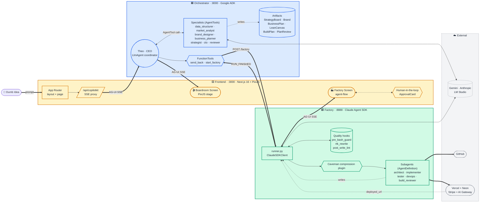
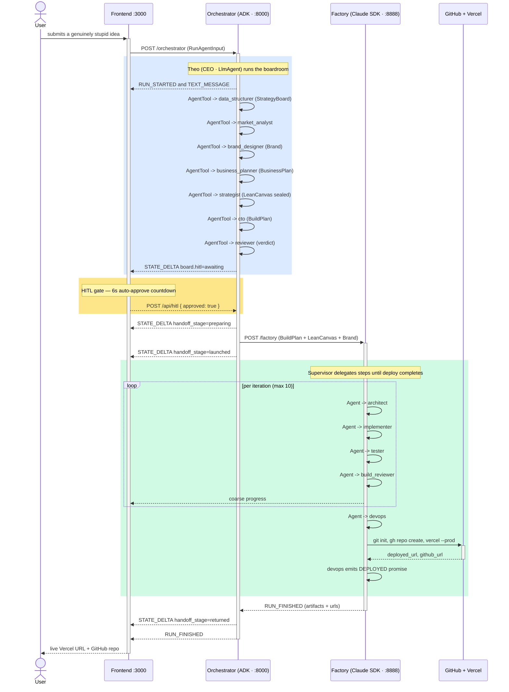
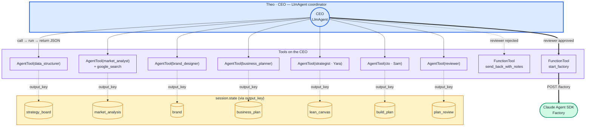
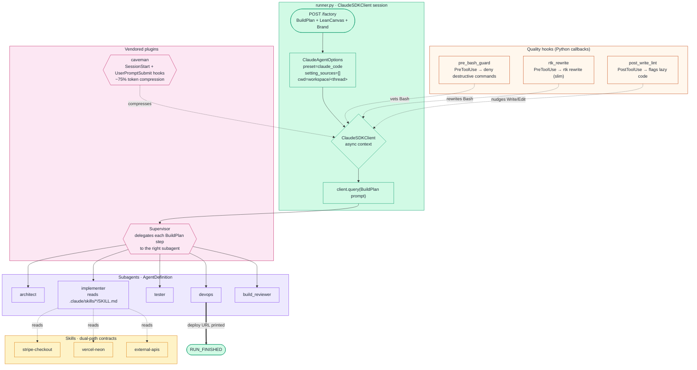
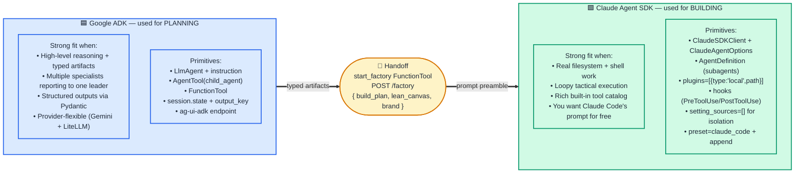
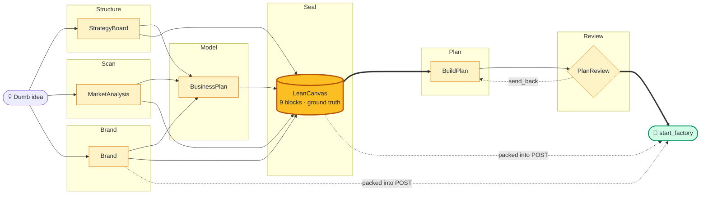
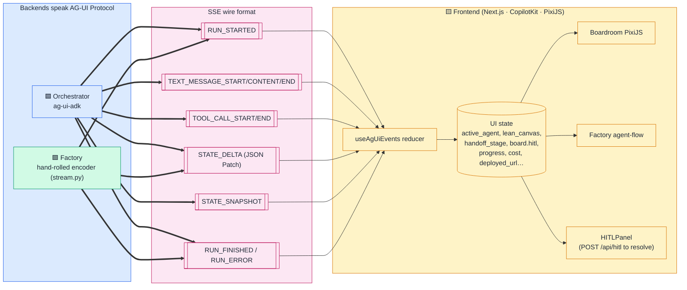
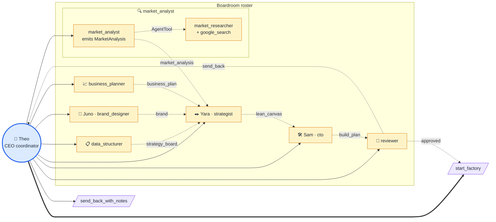
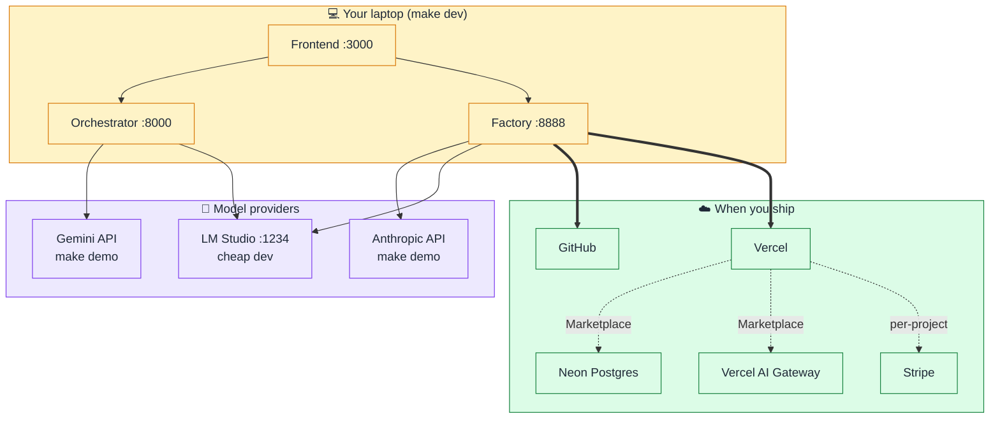

# Startup-in-a-Box — Diagram Atlas

Every architectural diagram in one page. Each one has a rendered SVG companion under `./diagrams/` — useful for pasting into slides.

For the prose version, see [`architecture.md`](./architecture.md).

---

## 1. System at a glance

Three independent services unified by the **AG-UI Protocol** over SSE.

- 🟦 **Orchestrator** (`:8000`) — Python · FastAPI · **Google ADK** · strategic planning ("Boardroom")
- 🟩 **Factory** (`:8888`) — Python · FastAPI · **Claude Agent SDK** + vendored Caveman plugin · tactical execution ("Factory")
- 🟨 **Frontend** (`:3000`) — Next.js 16 · React 19 · PixiJS · CopilotKit · dual-screen visualization

**Edge legend** — `==>` heavy = primary data path · `-->` solid = sync call · `-.->` dashed = streamed events / async

---

## 2. End-to-end pipeline sequence

---

## 3. The ADK delegator pattern

The CEO is an `LlmAgent` that keeps control across every turn. Specialists are `AgentTool(agent=child)` — not `sub_agents` — so returns come back to the CEO instead of dead-ending in a schema-constrained child.

> **Why not `sub_agents=[...]`?** A child with `output_schema` set can't transfer control back. `AgentTool` keeps the CEO in the driver's seat every turn.

---

## 4. The Claude Agent SDK loop

---

## 5. Handoff lifecycle (state machine)

The most subtle part of the system: the choreographed handoff between Boardroom and Factory. Both screens share `handoff_stage` via `STATE_DELTA` events.

```mermaid
stateDiagram-v2
    direction LR
    [*] --> idle: server boots

    idle --> planning: user submits idea
    planning --> structuring: data_structurer writes
    structuring --> scanning: market_analyst runs
    scanning --> branding: brand_designer writes
    branding --> modeling: business_planner writes
    modeling --> sealing: strategist seals LeanCanvas
    sealing --> architecting: CTO emits BuildPlan
    architecting --> reviewing: reviewer decides
    reviewing --> architecting: send_back_with_notes
    reviewing --> hitl: reviewer approves + CEO calls start_factory

    hitl --> preparing: POST /api/hitl approved (6s auto-approve)
    hitl --> failed: rejected by operator
    preparing --> launched: POST /factory accepted
    launched --> building: factory RUN_STARTED

    building --> building: tool_result tick / progress
    building --> returned: RUN_FINISHED
    building --> failed: RUN_ERROR

    returned --> shipped: SHIPPED token animates back
    shipped --> [*]
    failed --> [*]

    note right of hitl
        HITLPanel opens on Boardroom,
        6s countdown, operator can
        cancel / approve / reject.
    end note

    note right of preparing
        Beat 1: scroll leaves,
        boardroom desaturates
    end note

    note right of building
        Split screen: boardroom
        dim with progress ticker
        (ticks on subagent tool_result),
        factory full agent-flow
    end note

    note right of shipped
        Beat 3: scroll returns,
        unicorn confetti
    end note
```

---

## 6. Framework comparison (teaching slide)

---

## 7. The Lean Canvas funnel

The four upstream specialists write typed artifacts. Yara reconciles into the 9-block canvas. The CTO reads **only** the canvas — not the raw artifacts — so downstream decisions track a single sealed source of truth.

---

## 8. AG-UI event flow (one protocol, two backends)

---

## 9. Boardroom cast & delegation graph

> **Why the nested AgentTool on market_analyst?** Gemini refuses `output_schema` on any agent that also binds `google_search`. Splitting the role into a *researcher* (tools, prose out) and an *analyst* (no tools, structured JSON out) lets both constraints coexist. Same delegator pattern, one level deeper.

---

## 10. Where things run

---

## Ports, endpoints, protocols (reference table)

| Service              | Port   | Endpoint                  | Protocol                    |
| -------------------- | ------ | ------------------------- | --------------------------- |
| Orchestrator         | `8000` | `POST /orchestrator`      | AG-UI over SSE              |
| Orchestrator         | `8000` | `GET /health?deep=true`   | JSON                        |
| Factory              | `8888` | `POST /factory`           | AG-UI over SSE              |
| Factory              | `8888` | `GET /health?deep=true`   | JSON                        |
| Frontend             | `3000` | `/`                       | Next.js HTML                |
| Frontend             | `3000` | `/api/copilotkit/*`       | SSE proxy → orchestrator    |
| Frontend             | `3000` | `/api/ag-ui-log`          | JSON POST                   |
| Agent-Flow (dev viz) | `3001` | `/`                       | WS / HTTP                   |
| LM Studio (dev)      | `1234` | `/v1/*`                   | OpenAI-compatible           |

---

## Tech stack reference

| Layer        | Stack                                                                                        |
| ------------ | -------------------------------------------------------------------------------------------- |
| Orchestrator | `google-adk` · `ag-ui-adk` · `ag-ui-protocol` · `litellm` · FastAPI · Uvicorn                |
| Factory      | `claude-agent-sdk` · vendored Caveman plugin · built-in MCP tools              |
| Frontend     | Next.js 16 · React 19 · PixiJS 8 · `@pixi/react` · CopilotKit · Tailwind 4                   |
| Protocol     | AG-UI (`RUN_STARTED`, `STATE_DELTA`, `TEXT_MESSAGE_*`, `TOOL_CALL_*`, `RUN_FINISHED`)        |
| External     | Anthropic API · Gemini API · LM Studio (dev) · GitHub · Vercel · Neon · Stripe · AI Gateway  |
